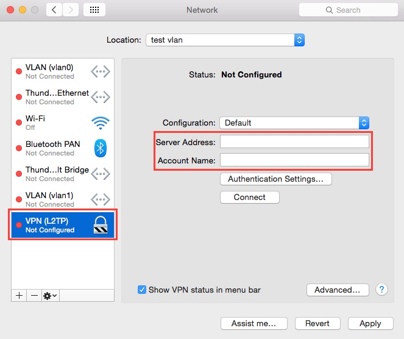

Mac OS X L2TP Client Setup
==========================

1. Click the network icon on the top-right side on the Mac screen. Click "Open
Network Preferences..." in the menu.

2. Click the "+" button on the network configuration screen.

3. Select "VPN" as "Interface" , "L2TP over IPsec" as "VPN Type" and click the
"Create" button.

4. A new L2TP VPN configuration will be created, and the configuration screen
will appear.

On this screen, you have to specify either hostname or IP address of the
destination SoftEther VPN Server.  After you specified the "Server Address" ,
input the user-name on the "Account Name" field, which is the next to the
"Server Address" field.  Next, click the "Authentication Settings..." button.

